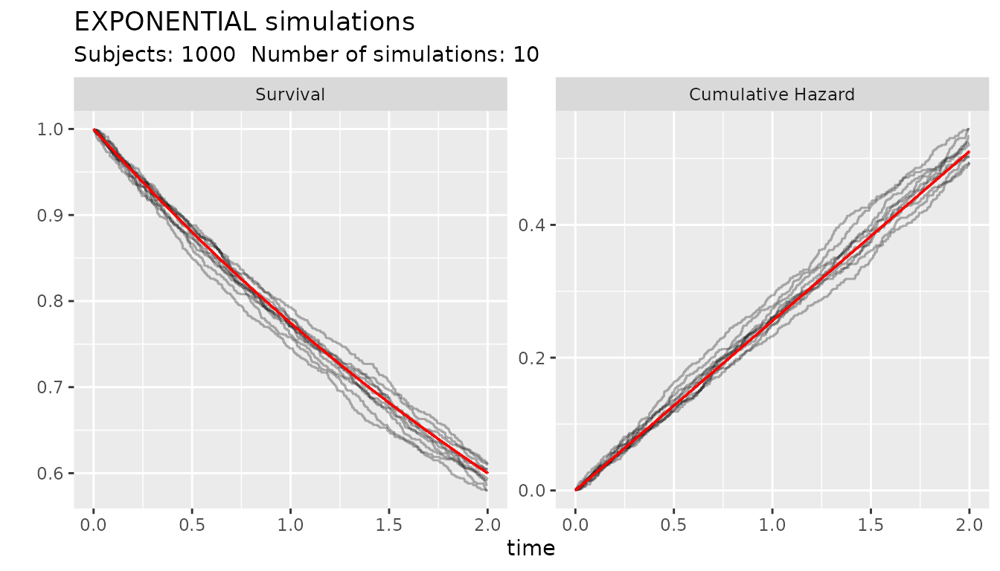
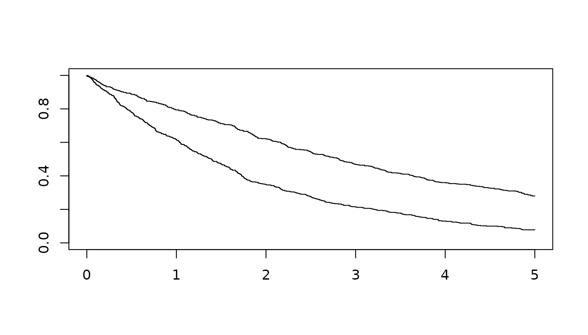
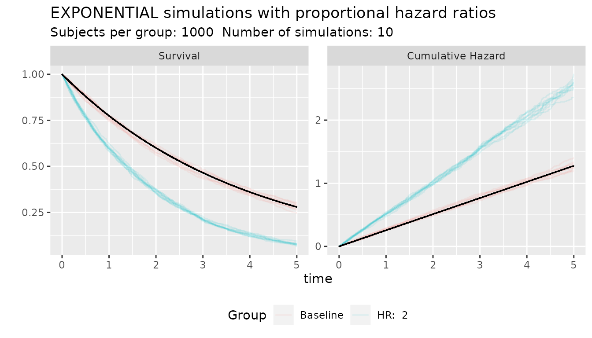
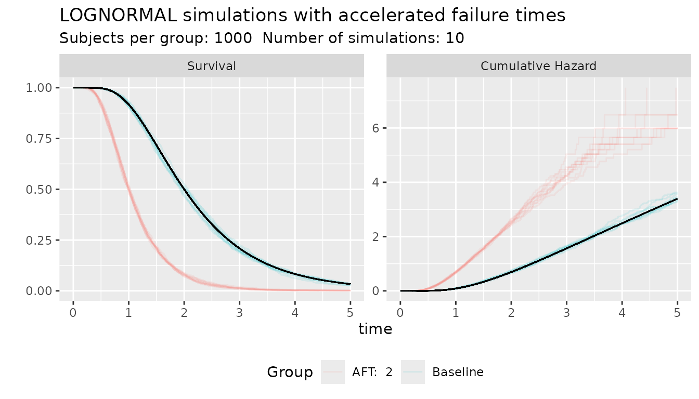
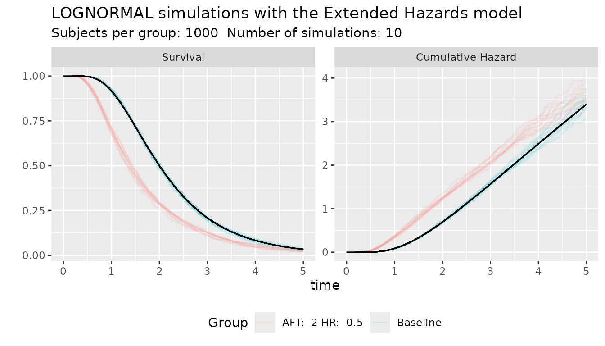

# Simulation of survival times

``` r

library(survobj)
library(survival)
```

## Introduction

Following Bender et al. (2003) and Leemis (1987), simulation of survival
times is possible if there is a function that inverts the cumulative
hazard ($`H^{-1}`$). Random survival times for a baseline distribution
can be generated from a uniform distribution between 0-1 $`U`$ as:
``` math
 T = H^{-1}(-log(U)) 
```
For a survival distribution object, this can be accomplished with the
function `rsurv(s_object, n)` which will generate `n` number of random
draws from the distribution `s_object`. All objects of the
s_distribution family implement a function that inverts the survival
time with the function
[`invCum_Hfx()`](https://johnaponte.github.io/survobj/reference/SURVIVAL.md)

The function
[`ggplot_survival_random()`](https://johnaponte.github.io/survobj/reference/SURVIVAL.md)
helps to graph Kaplan-Meier graphs and cumulative hazard of simulated
times from the distribution

``` r

s_obj <- s_exponential(fail = 0.4, t = 2)
ggplot_survival_random(s_obj, timeto =2, subjects = 1000, nsim= 10, alpha = 0.3)
```



## Generation of Proportional Hazard times

Survival times with hazard proportional to the baseline hazard can be
simulated
``` math
 T = H^{-1}\left(\frac{-log(U)}{HR}\right) 
```
where $`HR`$ is a hazard ratio.

The function `rsurvhr(s_object, hr)` can generate random numbers with
hazards proportional to the baseline hazard. The function produces as
many numbers as the length of the hr vector. for example:

``` r

s_obj <- s_exponential(fail = 0.4, t = 2)
group <- c(rep(0,500), rep(1,500))
hr_vector <- c(rep(1,500),rep(2,500))
times <- rsurvhr(s_obj, hr_vector)
plot(survfit(Surv(times)~group), xlim=c(0,5))
```


The function
[`ggplot_survival_hr()`](https://johnaponte.github.io/survobj/reference/SURVIVAL.md)
can plot simulated data under proportional hazard assumption.

``` r

s_obj <- s_exponential(fail = 0.4, t = 2)
ggplot_survival_hr(s_obj, hr = 2, nsim = 10, subjects = 1000, timeto = 5)
```



## Generation of Acceleration Failure Times

Survival times with accelerated failure time to the baseline hazard can
be simulated
``` math
 T = \frac{H^{-1}(-log(U))}{AFT}
```
where $`AFT`$ is an acceleration factor, meaning for example an AFT of 2
has events two times quicker than the baseline

The function `rsurvaft(s_object, aft)` can generate random numbers
accelerated by an AFT factor. The function produces as many numbers as
the length of the aft vector. for example:

``` r

s_obj <- s_lognormal(scale = 2, shape = 0.5)
ggplot_survival_aft(s_obj, aft = 2, nsim = 10, subjects = 1000, timeto = 5)
```



In this example, the scale parameter of the Log-Normal distribution
represents the median time, and in this simulation an acceleration
factor of 2 moves the median time from 2 to 1

## Generation of Extended Hazards times

The Proportional Hazards and the Accelerated Failure Time effects can be
combined into a single model. Following Chen and Jewell (2001), the
Extended Hazards model defines the hazard as
``` math
 h^*(t) = HR \cdot AFT \cdot h_0(AFT \cdot t) 
```
which gives the cumulative hazard $`H^*(t) = HR \cdot H_0(AFT \cdot t)`$
and survival time
``` math
 T = \frac{H_0^{-1}\left(\dfrac{-log(U)}{HR}\right)}{AFT} 
```
This model nests both models described above as special cases: setting
$`AFT = 1`$ recovers the Proportional Hazards model, and setting
$`HR = 1`$ recovers the Accelerated Failure Time model.

Note that this differs from the Accelerated Hazards model of Chen and
Wang (2000), $`h^*(t) = h_0(\theta t)`$, which rescales the baseline
hazard in time without the additional Jacobian factor. That model is
obtained from the Extended Hazards model above as the special case
$`HR = 1/AFT`$ (with $`\theta = AFT`$).

The function `rsurveh(s_object, aft, hr)` generates random numbers under
the Extended Hazards model. The function produces as many numbers as the
length of the `aft`/`hr` vectors, which must be of the same length. For
example:

``` r

s_obj <- s_lognormal(scale = 2, shape = 0.5)
ggplot_survival_eh(s_obj, aft = 2, hr = 0.5, nsim = 10, subjects = 1000, timeto = 5)
```



## Simulating recurrent episodes

When a subject can have more than one episode over follow-up (e.g.
repeated infections or hospitalizations), the time of each subsequent
episode can be generated conditional on the time of the previous one,
following Leemis (1987). Two assumptions about how risk behaves after an
episode give two different processes.

### Renewal process

Under a renewal process, risk resets after each episode: the time to the
next episode is a fresh, independent draw from the same (baseline,
proportional hazards, or accelerated failure time) distribution, added
to the time of the previous episode:
``` math
 T_{i+1} = T_i + H^{-1}\left(\frac{-\log(U)}{HR}\right) 
```
or, under an accelerated failure time effect,
``` math
 T_{i+1} = T_i + \frac{H^{-1}(-\log(U))}{AFT} 
```
This is implemented by `renewhr(s_object, hr, prevtime)` and
`renewaft(s_object, aft, prevtime)`, which take the time of the previous
episode `prevtime` and generate the time of the next one.

### Non-homogeneous Poisson process

Under a non-homogeneous Poisson process, risk does not reset after each
episode: a single cumulative hazard $`H(t)`$ accumulates over calendar
time from the start of follow-up, and consecutive episode times satisfy
$`H(T_{i+1}) - H(T_i) \sim \text{Exponential}(1)`$, so
``` math
 T_{i+1} = H^{-1}\left(H(T_i) - \frac{\log(U)}{HR}\right) 
```
or, under an accelerated failure time effect,
``` math
 T_{i+1} = \frac{H^{-1}\left(H(AFT \cdot T_i) - \log(U)\right)}{AFT} 
```
This is implemented by `nhpphr(s_object, hr, prevtime)` and
`nhppaft(s_object, aft, prevtime)`.

The difference between the two processes only shows up when the baseline
hazard is not constant. With an increasing baseline hazard, for example,
a renewal process keeps generating episodes at the same average pace,
since every episode resets the risk back to its starting point. Under a
non-homogeneous Poisson process, risk keeps accumulating over calendar
time and never resets, so later episodes follow each other increasingly
quickly:

``` r

# Weibull baseline with an increasing hazard (shape > 1)
s_obj <- s_weibull(scale = 1, shape = 2)
n <- 5000
hr <- rep(1, n)

# First episode, common to both processes
t1 <- rsurvhr(s_obj, hr)

# Renewal process: risk resets at each episode
t2 <- renewhr(s_obj, hr, t1)
t3 <- renewhr(s_obj, hr, t2)
c(gap1 = mean(t1), gap2 = mean(t2 - t1), gap3 = mean(t3 - t2))
#>      gap1      gap2      gap3 
#> 0.9030957 0.8846675 0.8930478

# Non-homogeneous Poisson process: risk keeps accumulating, never resets
p2 <- nhpphr(s_obj, hr, t1)
p3 <- nhpphr(s_obj, hr, p2)
c(gap1 = mean(t1), gap2 = mean(p2 - t1), gap3 = mean(p3 - p2))
#>      gap1      gap2      gap3 
#> 0.9030957 0.4395611 0.3283817
```

The average gap between episodes stays roughly constant under the
renewal process, while it shrinks with each successive episode under the
non-homogeneous Poisson process.

## References

Bender, R., Thomas Augustin, and Maria Blettner. 2003. “Generating
Survival Times to Simulate Cox Proportional Hazards Models.”
*Universitätsbibliothek Der Ludwig-Maximilians-Universität München*,
ahead of print. <https://doi.org/10.5282/UBM/EPUB.1716>.

Chen, Yong Q., and Nicholas P. Jewell. 2001. “On a General Class of
Semiparametric Hazards Regression Models.” *Biometrika* 88 (3): 687–702.
<https://doi.org/10.1093/biomet/88.3.687>.

Chen, Yong Q., and Mei-Cheng Wang. 2000. “Analysis of Accelerated
Hazards Models.” *Journal of the American Statistical Association* 95
(450): 608–18.

Leemis, Lawrence M. 1987. “Variate Generation for Accelerated Life and
Proportional Hazards Models.” *Operations Research* 35 (6): 892–94.
