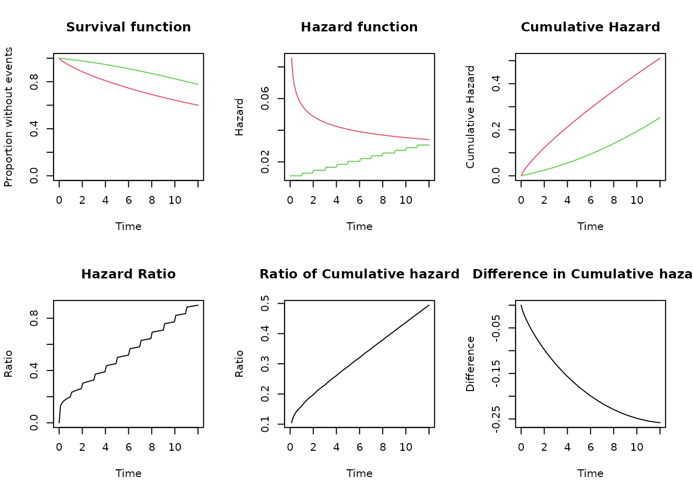

# Simulation trials: non-proportional hazard

## Introduction

We can use objects of the class SURVIVAL to simulate surviving times in
clinical trials. We present in this example the evaluation of empirical
power to detect non-proportionality of the hazard.

In this example, simulation of the survival times in the control group
follows a Weibull distribution with shape 0.8 (decreasing hazard) and a
failure rate of 0.4 at month 12. The experimental group has a vaccine
efficacy of 80% during the first month, but it decreases linearly to 10%
at month 12. We simulate survival times in the experimental group using
a piecewise exponential distribution with changes each month to follow
the linear decrease of vaccine efficacy.

The empirical power is defined as the percentage of simulations where
the p-value of the test for non-proportionality is lower than or equal
to 0.05

``` r

library(survobj)
library(survival)
```

## Empirical power to evaluate non-proportionality of the hazard

Assumptions:

- We made 1000 simulations

- There are 250 participants in each group, one group is control and the
  other is vaccinated

- The vaccine efficacy is 80% during the first month, and it decreases
  linearly to 10% at the end of month 12

- The control group follows a Weibull distribution with shape 0.8 and a
  failure rate of 0.4 at month 12.

- The simulated data is analyzed using Cox regression, and the
  proportionality of the hazard assumption evaluated following the
  method described by GRAMBSCH and THERNEAU (1994) and implemented in
  the `survival` package with the function
  [`cox.zph()`](https://rdrr.io/pkg/survival/man/cox.zph.html)

- We estimate the empirical power as the percentage of the simulations
  where the p-value of the coefficient for the group is 0.05 or lower.
  We present the empirical power and the distribution of the total
  number of events and the estimated vaccine efficacy

``` r


# Number of simulations
nsim = 1000

# Participants in each group
nsubjects = 250

# Follow-up time
ftime <- 12

# Vaccine efficacy
ve_start = 80
ve_end = 10

# Hazard ratio
hr <- function(t){
  vm <- ve_start - (ve_start-ve_end)/(ftime-1)*(t-1)
  1-vm/100
}

# Fail events in controls 
fail_control = 0.4

# Define Object with weibull distribution for events in controls
s_ctrl <- s_weibull(fail = fail_control, t = ftime, shape = 0.8)


# Define Object with Piecewise exponential distribution in vaccinated

s_vacc <- s_piecewise(
            breaks = c(1:12,Inf), 
            hazards = c(s_ctrl$hfx(1:12)*hr(1:12), s_ctrl$hfx(12)*hr(12)))
```

The following graph compares the two distributions

``` r

compare_survival(s_ctrl, s_vacc, timeto = 12)
```



## Simulation

``` r

set.seed(12345)

# Define the group for the subjects
group = c(rep(0, nsubjects), rep(1, nsubjects))
    

# Loop    
sim <- lapply(
  1:nsim,
  function(x){
    # Simulate survival times for event
    # Using one distribution for the controls and other for the vaccinated
    sim_time_event <- c(s_ctrl$rsurv(nsubjects), s_vacc$rsurv(nsubjects))
    
    # Censor events at end of follow-up.
    cevent <- censor_event(censor_time = ftime, time = sim_time_event, event = 1)
    ctime <- censor_time(censor_time = ftime, time = sim_time_event)
    
    # Analyze the data using cox regression
    reg <- coxph(Surv(ctime, cevent)~ group)
    sreg <- summary(reg)
    phz <- cox.zph(reg)
    
    # Collect the information
    pval = phz$table["group","p"]
    ve = (1- exp(sreg$coefficients["group","coef"]))*100
    nevents = sreg$nevent
    
    # return values
    return(data.frame(simid = x, pval,ve, nevents))
  }
)

# Join all the simulations in a single data frame
sim_df <- do.call(rbind, sim)
```

## Analyze the simulation

``` r

empirical_power = binom.test(sum(sim_df$pval <= 0.05), length(sim_df$pval))
empirical_power$estimate
#> probability of success 
#>                  0.839
empirical_power$conf.int
#> [1] 0.8147291 0.8612550
#> attr(,"conf.level")
#> [1] 0.95

# Distribution of the simulated VE estimated under PH assumption
summary(sim_df$ve)
#>    Min. 1st Qu.  Median    Mean 3rd Qu.    Max. 
#>   23.74   47.63   52.98   52.32   57.82   72.81

# Distribution of the simulated number of events
summary(sim_df$nevents)
#>    Min. 1st Qu.  Median    Mean 3rd Qu.    Max. 
#>     126     149     156     156     163     184
```

## Conclusion

The simulation provides an estimate of the empirical power to reject the
proportionality of the hazard assumption in this condition as 83.9% with
a 95%CI of ( 81.5%, 86.1% )

## References

GRAMBSCH, PATRICIA M., and TERRY M. THERNEAU. 1994. “Proportional
Hazards Tests and Diagnostics Based on Weighted Residuals.” *Biometrika*
81 (3): 515–26. <https://doi.org/10.1093/biomet/81.3.515>.
