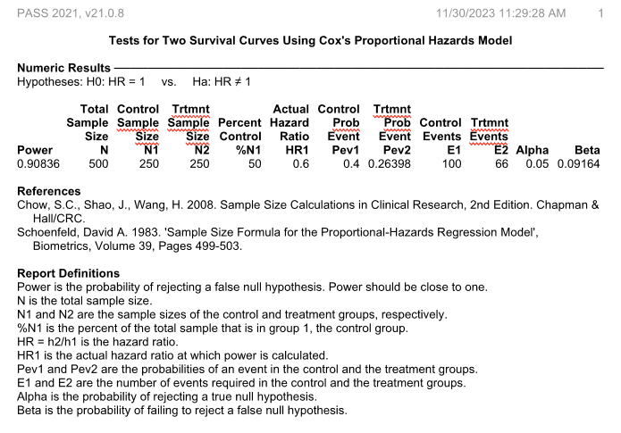

```{r, include = FALSE}
knitr::opts_chunk$set(
  collapse = TRUE,
  comment = "#>"
)
```

## Introduction

We can use objects of the class SURVIVAL to simulate surviving times in
clinical trials. We present one example in which we want to estimate the
empirical power to detect significantly a vaccine efficacy.

The empirical power is define as the percentage of times the p-value for the 
coefficient that indicates the treatment is equal or below 0.05.

```{r setup}
library(survobj)
library(survival)
```

## Empirical power for superiority

Assumptions:

-   We made 1000 simulations

-   There are 250 participants in each group, one group is control and
    the other is vaccinated

-   The vaccine efficacy is 40% (i.e the hazard ratio is 1-40/100 = 0.6)

-   The control group follows an exponential distribution with 40% of
    subjects having an event at time 12 months (365.25 days)

-   The simulated data is analyzed using Cox regression.

-   We estimate the empirical power as the percentage of the simulations
    where the p-value of the coefficient for the group is 0.05 or lower.
    We present the empirical power and the distribution of the total
    number of events and the estimated vaccine efficacy

```{r simulation1, fig.align='center', fig.width= 7, fig.height=5}

# Number of simulations
nsim = 1000

# Participants in each group
nsubjects = 250

# Vaccine efficacy
ve = 40

# Hazard ratio
hr = 1-ve/100

# Follow-up time
ftime <- 12

# Fail events in controls 
fail_control = 0.4

# Define Object with exponential distribution for events in controls
s_events <- s_exponential(fail = fail_control, t = ftime)

```

## Simulation

```{r simulation, eval= FALSE}
set.seed(12345)

# Define the group for the subjects
group = c(rep(0, nsubjects), rep(1, nsubjects))
    
# Define the hazard ratio according to the group
hr_vector <- ifelse(group ==0,1,hr)

# Loop    
sim <- lapply(
  1:nsim,
  function(x){
    # Simulate survival times for event
    sim_time_event <- s_events$rsurvhr(hr_vector)
    
    # Censor events at end of follow-up.
    cevent <- censor_event(censor_time = ftime, time = sim_time_event, event = 1)
    ctime <- censor_time(censor_time = ftime, time = sim_time_event)
    
    # Analyze the data using cox regression
    reg <- summary(coxph(Surv(ctime, cevent)~ group))
    
    # Collect the information
    pval = reg$coefficients["group","Pr(>|z|)"]
    ve = (1- exp(reg$coefficients["group","coef"]))*100
    nevents = reg$nevent
    
    # return values
    return(data.frame(simid = x, pval,ve, nevents))
  }
)

# Join all the simulations in a single data frame
sim_df <- do.call(rbind, sim)
```


```{r loadsimul, include=FALSE }
 # The simulation takes to much time to be included in CRAN
 # Load a previous simulation
 load("sim_df.rda")
```

## Analyze the simulation

```{r analyze}
empirical_power = binom.test(sum(sim_df$pval <= 0.05), length(sim_df$pval))
empirical_power$estimate
empirical_power$conf.int

# Distribution of the simulated VEs}
summary(sim_df$ve)

# Distribution of the simulated number of events
summary(sim_df$nevents)
```

## Conclusion

The simulation provides an estimate of the empirical power of 
`r round(empirical_power$estimate*100,1)`% with a 95%CI of 
(
`r round(empirical_power$conf.int[1]*100,1)`%,
`r round(empirical_power$conf.int[2]*100,1)`%
)

As reference, the output of power calculation using PASS 2021(R) using
the same parameters


